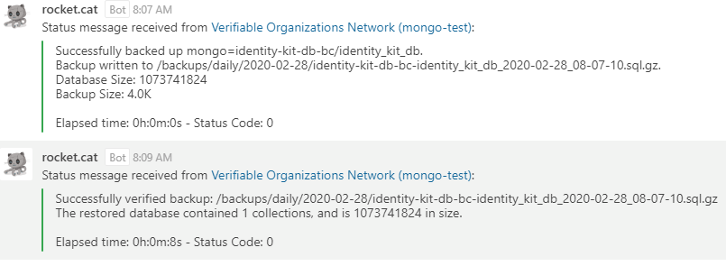

[](LICENSE)

_Table of Contents_

<!-- TOC depthTo:2 -->

- [Backup Container](#backup-container)
  - [Supported Databases](#supported-databases)
- [Backup Container Options](#backup-container-options)
  - [Backups in OpenShift](#backups-in-openshift)
  - [Storage](#storage)
    - [Backup Storage Volume](#backup-storage-volume)
      - [NFS Storage Backup and Retention Policy](#nfs-storage-backup-and-retention-policy)
    - [Restore/Verification Storage Volume](#restoreverification-storage-volume)
    - [Storage Performance](#storage-performance)
  - [Deployment / Configuration](#deployment--configuration)
    - [backup.conf](#backupconf)
    - [Cron Mode](#cron-mode)
    - [Cronjob Deployment / Configuration / Constraints](#cronjob-deployment--configuration--constraints)
    - [Resources](#resources)
  - [Multiple Databases](#multiple-databases)
  - [Backup Strategies](#backup-strategies)
    - [Daily](#daily)
    - [Rolling](#rolling)
  - [Using the Backup Script](#using-the-backup-script)
  - [Using Backup Verification](#using-backup-verification)
  - [Using the FTP backup](#using-the-ftp-backup)
  - [Using the Webhook Integration](#using-the-webhook-integration)
  - [Database Plugin Support](#database-plugin-support)
  - [Backup](#backup)
    - [Immediate Backup:](#immediate-backup)
      - [Execute a single backup cycle with the pod deployment](#execute-a-single-backup-cycle-with-the-pod-deployment)
      - [Execute an on demand backup using the scheduled job](#execute-an-on-demand-backup-using-the-scheduled-job)
    - [Restore](#restore)
  - [Network Policies](#network-policies)
- [Example Deployments](#example-deployments)
  - [Deploy with Helm Chart](#deploy-with-helm-chart)
- [Prebuilt Container Images](#prebuilt-container-images)
- [Postgres Base Version](#postgres-base-version)
- [Tip and Tricks](#tip-and-tricks)
- [Getting Help or Reporting an Issue](#getting-help-or-reporting-an-issue)
- [How to Contribute](#how-to-contribute)

<!-- /TOC -->

# Introduction

This backup system is a straightforward containerized solution designed to back up one or more supported databases to a secondary location.
## Supported Databases & Secondary Locations

### Databases

- PostgresSQL
- MongoDB
- MariaDB
- MSSQL - Currently MSSQL requires that the nfs db volume be shared with the database for backups to function correctly.

### Secondary Locations

- OCIO backup infrastructure
- Amazon S3 (S3 Compatible / OCIO Object Store)
- FTP Server

# Backup Container Options

You have the option to run the Backup Container for supported databases either separately or in a mixed environment. If you choose the mixed environment, please follow these guidelines:

1. It is required to use the recommended `backup.conf` configuration.
2. Within the `backup.conf` file, make sure to specify the `DatabaseType` for each listed database.
3. For each type of supported backup container being used, you will need to create a build and deployment configuration.
4. Make sure to mount the same `backup.conf` file (ConfigMap) to each deployed container.

These steps will help ensure the smooth operation of the backup system.

## Backups in OpenShift

This project provides you with a starting point for integrating backups into your OpenShift projects. The scripts and templates provided in the [openshift](./openshift) directory are compatible with the [openshift-developer-tools](https://github.com/BCDevOps/openshift-developer-tools) scripts. They help you create an OpenShift deployment or cronjob called `backup` in your projects that runs backups on databases within the project environment. You only need to integrate the scripts and templates into your project(s), the builds can be done with this repository as the source.

As an alternative to using the command line interface `oc` ([OpenShift CLI](https://access.redhat.com/documentation/en-us/openshift_container_platform/4.12/html-single/cli_tools/index)), you can integrate the backup configurations (Build and Deployment templates, override script, and config) directly into your project configuration and manage the publishing and updating of the Build and Deployment configurations using the [BCDevOps/openshift-developer-tools](https://github.com/BCDevOps/openshift-developer-tools/tree/master/bin) scripts. An example can be found in the [bcgov/orgbook-configurations](https://github.com/bcgov/orgbook-configurations) repository under the [backup templates folder](https://github.com/bcgov/orgbook-configurations/tree/master/openshift/templates/backup).

Simplified documentation on how to use the tools can be found [here](https://github.com/bcgov/jag-cullencommission/tree/master/openshift). All scripts support a `-c` option that allows you to perform operations on a single component of your application such as the backup container. In the orgbook-configurations example above, note the `-c backup` argument supplied.

Following are the instructions for running the backups and a restore.

## Storage

The backup container utilizes two volumes: one for storing the backups and another for restore/verification testing. The deployment template deliberately separates these volumes.

The upcoming sections on storage will provide you with recommendations and limitations regarding the storage classes.

### Backup Storage Volume

We recommend using the `netapp-file-backup` storage class for the backup Persistent Volume Claim (PVC). This storage class is supported by the standard OCIO backup infrastructure and has a default quota of 25Gi. If you require additional storage, please submit an iStore request to adjust the quota accordingly. The backup retention policy for the backup infrastructure is as follows:

- Backup:
  - Daily: Incremental
  - Monthly: Full
- Retention: 90 days

If you are utilizing S3 storage or the corporate S3 compatible storage, you may not need to use the `netapp-file-backup` storage class. These systems are already replicated and highly redundant. In such cases, we recommend using the following storage classes:
- `netapp-file-standard` for backup storage
- `netapp-file-standard` for restore/verification storage

To implement this, create a PVC using the the appropriate storage class and mount it to your pod at the `/backups` mount point. Or, if you're using the provided deployment template, update or override the `BACKUP_VOLUME_STORAGE_CLASS` parameter.

For more detailed information, please visit the [DevHub](https://developer.gov.bc.ca/OCP4-Backup-and-Restore) page.

### Restore / Verification Storage Volume

The restore/verification volume should use the default storage class `netapp-file-standard`. Please avoid using `netapp-file-backup` as it is not suitable for transient workloads. The provided deployment template will automatically provision this volume when it is published.

Ensure that the volume is large enough to accommodate your largest database. You can set the size by updating or overriding the `VERIFICATION_VOLUME_SIZE` parameter in the provided OpenShift template.

### Storage Performance

Our PVC are supported by NetApp storage. It's important to note that the performance of the storage is not affected by the storage class chosen. 
## Deployment / Configuration

Together, the scripts and templates provided in the [openshift](./openshift) directory will automatically deploy the `backup` app as described below. The [backup-deploy.overrides.sh](./openshift/backup-deploy.overrides.sh) script generates the deployment configuration necessary for the [backup.conf](config/backup.conf) file to be mounted as a ConfigMap by the `backup` container.

The following environment variables are defaults used by the `backup` app.

**NOTE**: These environment variables MUST MATCH those used by the database container(s) you are planning to backup.

| Name                       | Default (if not set) | Purpose                                                                                                                                                                                                                                                                                                                                                                       |
| -------------------------- | -------------------- | ----------------------------------------------------------------------------------------------------------------------------------------------------------------------------------------------------------------------------------------------------------------------------------------------------------------------------------------------------------------------------- |
| BACKUP_STRATEGY            | rolling              | To control the backup strategy used for backups. This is explained more below.                                                                                                                                                                                                                                                                                                |
| BACKUP_DIR                 | /backups/            | The directory under which backups will be stored. The deployment configuration mounts the persistent volume claim to this location when first deployed.                                                                                                                                                                                                                       |
| NUM_BACKUPS                | 31                   | Used for backward compatibility only, this value is used with the daily backup strategy to set the number of backups to retain before pruning.                                                                                                                                                                                                                                |
| DAILY_BACKUPS              | 6                    | When using the rolling backup strategy this value is used to determine the number of daily (Mon-Sat) backups to retain before pruning.                                                                                                                                                                                                                                        |
| WEEKLY_BACKUPS             | 4                    | When using the rolling backup strategy this value is used to determine the number of weekly (Sun) backups to retain before pruning.                                                                                                                                                                                                                                           |
| MONTHLY_BACKUPS            | 1                    | When using the rolling backup strategy this value is used to determine the number of monthly (last day of the month) backups to retain before pruning.                                                                                                                                                                                                                        |
| BACKUP_PERIOD              | 1d                   | Only used for Legacy Mode. Ignored when running in Cron Mode. The schedule on which to run the backups. The value is used by a sleep command and can be defined in d, h, m, or s.                                                                                                                                                                                             |
| DATABASE_SERVICE_NAME      | postgresql           | Used for backward compatibility only. The name of the service/host for the _default_ database target.                                                                                                                                                                                                                                                                         |
| DATABASE_USER_KEY_NAME     | database-user        | The database user key name stored in database deployment resources specified by DATABASE_DEPLOYMENT_NAME.                                                                                                                                                                                                                                                                     |
| DATABASE_PASSWORD_KEY_NAME | database-password    | The database password key name stored in database deployment resources specified by DATABASE_DEPLOYMENT_NAME.                                                                                                                                                                                                                                                                 |
| DATABASE_NAME              | my_postgres_db       | Used for backward compatibility only. The name of the _default_ database target; the name of the database you want to backup.                                                                                                                                                                                                                                                 |
| DATABASE_USER              | _wired to a secret_  | The username for the database(s) hosted by the database server. The deployment configuration makes the assumption you have your database credentials stored in secrets (which you should), and the key for the username is `database-user`. The name of the secret must be provided as the `DATABASE_DEPLOYMENT_NAME` parameter to the deployment configuration template.     |
| DATABASE_PASSWORD          | _wired to a secret_  | The password for the database(s) hosted by the database server. The deployment configuration makes the assumption you have your database credentials stored in secrets (which you should), and the key for the username is `database-password`. The name of the secret must be provided as the `DATABASE_DEPLOYMENT_NAME` parameter to the deployment configuration template. |
| FTP_URL                    |                      | The FTP server URL. If not specified, the FTP backup feature is disabled. The default value in the deployment configuration is an empty value - not specified. |
| FTP_USER | _wired to a secret_  | The username for the FTP server. The deployment configuration creates a secret with the name specified in the FTP_SECRET_KEY parameter (default: `ftp-secret`). The key for the username is `ftp-user` and the value is an empty value by default. |
| FTP_PASSWORD               | _wired to a secret_  | The password for the FTP server. The deployment configuration creates a secret with the name specified in the FTP_SECRET_KEY parameter (default: `ftp-secret`). The key for the password is `ftp-password` and the value is an empty value by default. |
| S3_USER | No Default  | The username for the S3 compatible object store. This may also be referred to as the "Access key" in AWS S3. |
| S3_PASSWORD | No Default  | The password for the S3 compatible object store. This may also be referred to as the "Secret key" in AWS. |
| S3_ENDPOINT | None  |  The AWS endpoint to use for S3 compatible object storage. For OpenShift minio use `http://minio-service:9000` |
| S3_BUCKET | None | The bucket where you backups will be transferd to. |
| WEBHOOK_URL | | The URL of the webhook endpoint to use for notifications. If not specified, the webhook integration feature is disabled. The default value in the deployment configuration is an empty value - not specified. |
| ENVIRONMENT_FRIENDLY_NAME  | | A friendly (human readable) name of the environment. This variable is used by the webhook integration to identify the environment from which the backup notifications originate. The default value in the deployment configuration is an empty value - not specified. |
| ENVIRONMENT_NAME | | A name or ID of the environment. This variable is used by the webhook integration to identify the environment from which the backup notifications originate. The default value in the deployment configuration is an empty value - not specified. |

### backup.conf

Using this default configuration you can easily back up a single postgres database, however we recommend you extend the configuration and use the `backup.conf` file to list a number of databases for backup and even set a cron schedule for the backups.

When using the `backup.conf` file the following environment variables are ignored, since you list all of your `host`/`database` pairs in the file; `DATABASE_SERVICE_NAME`, `DATABASE_NAME`. To provide the credentials needed for the listed databases you extend the deployment configuration to include `hostname_USER` and `hostname_PASSWORD` credential pairs which are wired to the appropriate secrets (where hostname matches the hostname/servicename, in all caps and underscores, of the database). For example, if you are backing up a database named `wallet-db/my_wallet`, you would have to extend the deployment configuration to include a `WALLET_DB_USER` and `WALLET_DB_PASSWORD` credential pair, wired to the appropriate secrets, to access the database(s) on the `wallet-db` server.

### Cron Mode

The `backup` container supports running the backups on a cron schedule. The schedule is specified in the `backup.conf` file. Refer to the [backup.conf](./config/backup.conf) file for additional details and examples.

### Cronjob Deployment / Configuration / Constraints

_This section describes the configuration of an OpenShift CronJob this is different than the Cron Mode supported by the container when deployed in "long running" mode._

The cronjob object can be deployed in the same manner as the application, and will also have a dependency on the image built by the build config. The main constraint for the cronjob objects is that they will require a configmap in place of environment variables and does not support the `backup.conf` for multiple database backups in the same job. In order to backup multiple databases, create multiple cronjob objects with their associated configmaps and secrets.

The following variables are supported in the first iteration of the backup cronjob:

| Name                       | Default (if not set) | Purpose                                                                                                                                                                                                                                                                                                                                                                                    |
| -------------------------- | -------------------- | ------------------------------------------------------------------------------------------------------------------------------------------------------------------------------------------------------------------------------------------------------------------------------------------------------------------------------------------------------------------------------------------ |
| BACKUP_STRATEGY            | daily                | To control the backup strategy used for backups. This is explained more below.                                                                                                                                                                                                                                                                                                             |
| BACKUP_DIR                 | /backups/            | The directory under which backups will be stored. The deployment configuration mounts the persistent volume claim to this location when first deployed.                                                                                                                                                                                                                                    |
| SCHEDULE                   | 0 1 \* \* \*         | Cron Schedule to Execute the Job (using local cluster system TZ).                                                                                                                                                                                                                                                                                                                          |
| NUM_BACKUPS                | 31                   | For backward compatibility this value is used with the daily backup strategy to set the number of backups to retain before pruning.                                                                                                                                                                                                                                                        |
| DAILY_BACKUPS              | 6                    | When using the rolling backup strategy this value is used to determine the number of daily (Mon-Sat) backups to retain before pruning.                                                                                                                                                                                                                                                     |
| WEEKLY_BACKUPS             | 4                    | When using the rolling backup strategy this value is used to determine the number of weekly (Sun) backups to retain before pruning.                                                                                                                                                                                                                                                        |
| MONTHLY_BACKUPS            | 1                    | When using the rolling backup strategy this value is used to determine the number of monthly (last day of the month) backups to retain before pruning.                                                                                                                                                                                                                                     |
| DATABASE_SERVICE_NAME      | postgresql           | The name of the service/host for the _default_ database target.                                                                                                                                                                                                                                                                                                                            |
| DATABASE_USER_KEY_NAME     | database-user        | The database user key name stored in database deployment resources specified by DATABASE_DEPLOYMENT_NAME.                                                                                                                                                                                                                                                                                  |
| DATABASE_PASSWORD_KEY_NAME | database-password    | The database password key name stored in database deployment resources specified by DATABASE_DEPLOYMENT_NAME.                                                                                                                                                                                                                                                                              |
| POSTGRESQL_DATABASE        | my_postgres_db       | The name of the _default_ database target; the name of the database you want to backup.                                                                                                                                                                                                                                                                                                    |
| POSTGRESQL_USER            | _wired to a secret_  | The username for the database(s) hosted by the `postgresql` Postgres server. The deployment configuration makes the assumption you have your database credentials stored in secrets (which you should), and the key for the username is `database-user`. The name of the secret must be provided as the `DATABASE_DEPLOYMENT_NAME` parameter to the deployment configuration template.     |
| POSTGRESQL_PASSWORD        | _wired to a secret_  | The password for the database(s) hosted by the `postgresql` Postgres server. The deployment configuration makes the assumption you have your database credentials stored in secrets (which you should), and the key for the username is `database-password`. The name of the secret must be provided as the `DATABASE_DEPLOYMENT_NAME` parameter to the deployment configuration template. |

The following variables are NOT supported:

| Name          | Default (if not set) | Purpose                                                                                                  |
| ------------- | -------------------- | -------------------------------------------------------------------------------------------------------- |
| BACKUP_PERIOD | 1d                   | The schedule on which to run the backups. The value is replaced by the cron schedule variable (SCHEDULE) |

The scheduled job does not yet support the FTP environment variables.

| Name         |
| ------------ |
| FTP_URL      |
| FTP_USER     |
| FTP_PASSWORD |

### Resources

The backup-container is assigned with `Best-effort` resource type (setting zero for request and limit), which allows the resources to scale up and down without an explicit limit as resource on the node allow. It benefits from large bursts of recourses for short periods of time to get things more quickly. After some time of running the backup-container, you could then set the request and limit according to the average resource consumption.

## Multiple Databases

When backing up multiple databases, the retention settings apply to each database individually. For instance if you use the `daily` strategy and set the retention number(s) to 5, you will retain 5 copies of each database. So plan your backup storage accordingly.

An example of the backup container in action can be found here; [example log output](./docs/ExampleLog.md)

## Backup Strategies

The `backup` app supports two backup strategies, each are explained below. Regardless of the strategy backups are identified using a core name derived from the `host/database` specification and a timestamp. All backups are compressed using gzip.

### Daily

The daily backup strategy is very simple. Backups are created in dated folders under the top level `/backups/` folder. When the maximum number of backups (`NUM_BACKUPS`) is exceeded, the oldest ones are pruned from disk.

For example (faked):

```
================================================================================================================================
Current Backups:
--------------------------------------------------------------------------------------------------------------------------------
1.0K    2018-10-03 22:16        ./backups/2018-10-03/postgresql-TheOrgBook_Database_2018-10-03_22-16-11.sql.gz
1.0K    2018-10-03 22:16        ./backups/2018-10-03/postgresql-TheOrgBook_Database_2018-10-03_22-16-28.sql.gz
1.0K    2018-10-03 22:16        ./backups/2018-10-03/postgresql-TheOrgBook_Database_2018-10-03_22-16-46.sql.gz
1.0K    2018-10-03 22:16        ./backups/2018-10-03/wallet-db-tob_holder_2018-10-03_22-16-13.sql.gz
1.0K    2018-10-03 22:16        ./backups/2018-10-03/wallet-db-tob_holder_2018-10-03_22-16-31.sql.gz
1.0K    2018-10-03 22:16        ./backups/2018-10-03/wallet-db-tob_holder_2018-10-03_22-16-48.sql.gz
1.0K    2018-10-03 22:16        ./backups/2018-10-03/wallet-db-tob_verifier_2018-10-03_22-16-08.sql.gz
1.0K    2018-10-03 22:16        ./backups/2018-10-03/wallet-db-tob_verifier_2018-10-03_22-16-25.sql.gz
1.0K    2018-10-03 22:16        ./backups/2018-10-03/wallet-db-tob_verifier_2018-10-03_22-16-43.sql.gz
13K     2018-10-03 22:16        ./backups/2018-10-03
...
61K     2018-10-04 10:43        ./backups/
================================================================================================================================
```

### Rolling

The rolling backup strategy provides a bit more flexibility. It allows you to keep a number of recent `daily` backups, a number of `weekly` backups, and a number of `monthly` backups.

- Daily backups are any backups done Monday through Saturday.
- Weekly backups are any backups done at the end of the week, which we're calling Sunday.
- Monthly backups are any backups done on the last day of a month.

There are retention settings you can set for each. The defaults provide you with a week's worth of `daily` backups, a month's worth of `weekly` backups, and a single backup for the previous month.

Although the example does not show any `weekly` or `monthly` backups, you can see from the example that the folders are further broken down into the backup type.

For example (faked):

```
================================================================================================================================
Current Backups:
--------------------------------------------------------------------------------------------------------------------------------
0       2018-10-03 22:16        ./backups/daily/2018-10-03
1.0K    2018-10-04 09:29        ./backups/daily/2018-10-04/postgresql-TheOrgBook_Database_2018-10-04_09-29-52.sql.gz
1.0K    2018-10-04 10:37        ./backups/daily/2018-10-04/postgresql-TheOrgBook_Database_2018-10-04_10-37-15.sql.gz
1.0K    2018-10-04 09:29        ./backups/daily/2018-10-04/wallet-db-tob_holder_2018-10-04_09-29-55.sql.gz
1.0K    2018-10-04 10:37        ./backups/daily/2018-10-04/wallet-db-tob_holder_2018-10-04_10-37-18.sql.gz
1.0K    2018-10-04 09:29        ./backups/daily/2018-10-04/wallet-db-tob_verifier_2018-10-04_09-29-49.sql.gz
1.0K    2018-10-04 10:37        ./backups/daily/2018-10-04/wallet-db-tob_verifier_2018-10-04_10-37-12.sql.gz
22K     2018-10-04 10:43        ./backups/daily/2018-10-04
22K     2018-10-04 10:43        ./backups/daily
4.0K    2018-10-03 22:16        ./backups/monthly/2018-10-03
4.0K    2018-10-03 22:16        ./backups/monthly
4.0K    2018-10-03 22:16        ./backups/weekly/2018-10-03
4.0K    2018-10-03 22:16        ./backups/weekly
61K     2018-10-04 10:43        ./backups/
================================================================================================================================
```

## Using the Backup Script

The [backup script](./docker/backup.sh) has a few utility features built into it. For a full list of features and documentation run `backup.sh -h`.

Features include:

- The ability to list the existing backups, `backup.sh -l`
- Listing the current configuration, `backup.sh -c`
- Running a single backup cycle, `backup.sh -1`
- Restoring a database from backup, `backup.sh -r <databaseSpec/> [-f <backupFileFilter>]`
  - Restore mode will allow you to restore a database to a different location (host, and/or database name) provided it can contact the host and you can provide the appropriate credentials.
- Verifying backups, `backup.sh [-s] -v <databaseSpec/> [-f <backupFileFilter>]`
  - Verify mode will restore a backup to the local server to ensure it can be restored without error. Once restored a table query is performed to ensure there was at least one table restored and queries against the database succeed without error. All database files and configuration are destroyed following the tests.

## Using Backup Verification

The [backup script](./docker/backup.sh) supports running manual or scheduled verifications on your backups; `backup.sh [-s] -v <databaseSpec/> [-f <backupFileFilter>]`. Refer to the script documentation `backup.sh -h`, and the configuration documentation, [backup.conf](config/backup.conf), for additional details on how to use this feature.

## Using the FTP backup

- The FTP backup feature is enabled by specifying the FTP server URL `FTP_URL`.
- The FTP server must support FTPS.
- Path can be added to the URL. For example, the URL can be `ftp://ftp.gov.bc.ca/schoolbus-db-backup/`. Note that when adding path, the URL must be ended with `/` as the example.
- The username and password must be populated in the secret key. Refer to the deployment configuration section.
- There is a known issue for FTPS with Windows 2012 FTP. http://redoubtsolutions.com/fix-the-supplied-message-is-incomplete-error-when-you-use-an-ftps-client-to-upload-a-file-in-windows/

## Using the Webhook Integration

The Webhook integration feature is enabled by specifying the webhook URL, `WEBHOOK_URL`, in your configuration. It's recommended that you also provide values for `ENVIRONMENT_FRIENDLY_NAME` and `ENVIRONMENT_NAME`, so you can better identify the environment from which the messages originate and do things like produce links to the environment.

The Webhook integration feature was built with Rocket.Chat in mind and an integration script for Rocket.Chat can be found in [rocket.chat.integration.js](./scripts/rocket.chat.integration.js). This script was developed to support the BC OpenShift Pathfinder environment and will format the notifications from the backup script into Rocket.Chat messages (examples below). If you provide values for the environment name (`ENVIRONMENT_FRIENDLY_NAME` and `ENVIRONMENT_NAME`) hyperlinks will be added to the messages to link you to the pathfinder project console.

Sample Message:



Sample Error Message:


For information on how setup a webhook in Rocket.Chat refer to [Incoming WebHook Scripting](https://rocket.chat/docs/administrator-guides/integrations/). The **Webhook URL** created during this process is the URL you use for `WEBHOOK_URL` to enable the Webhook integration feature.

## Database Plugin Support

The backup container uses a plugin architecture to perform the database specific operations needed to support various database types.

The plugins are loaded dynamically based on the container type. By default the `backup.null.plugin` will be loaded when the container type is not recognized.

To add support for a new database type:

1. Update the `getContainerType` function in [backup.container.utils](./docker/backup.container.utils) to detect the new type of database.
2. Using the existing plugins as reference, implement the database specific scripts for the new database type.
3. Using the existing docker files as reference, create a new one to build the new container type.
4. Update the build and deployment templates and their documentation as needed.
5. Update the project documentation as needed.
6. Test, test, test.
7. Submit a PR.

Plugin Examples:

- [backup.postgres.plugin](./docker/backup.postgres.plugin)

  - Postgres backup implementation.

- [backup.mongo.plugin](./docker/backup.mongo.plugin)

  - Mongo backup implementation.

- [backup.mssql.plugin](./docker/backup.mssql.plugin)

  - MSSQL backup implementation.

- [backup.mariadb.plugin](./docker/backup.mariadb.plugin)

  - MariaDB backup implementation. This plugin should also work with mysql, but is currently untested.

- [backup.null.plugin](./docker/backup.null.plugin)
  - Sample/Template backup implementation that simply outputs log messages for the various operations.

## Backup

_The following sections describes (some) postgres specific implementation, however the steps are generally the same between database implementations._

The purpose of the backup app is to do automatic backups. Deploy the Backup app to do daily backups. Viewing the Logs for the Backup App will show a record of backups that have been completed.

The Backup app performs the following sequence of operations:

1. Create a directory that will be used to store the backup.
2. Use the `pg_dump` and `gzip` commands to make a backup.
3. Cull backups more than $NUM_BACKUPS (default 31 - configured in deployment script)
4. Wait/Sleep for a period of time and repeat

Note that with the pod deployment, we support cron schedule(s) or the legacy mode (which uses a simple "sleep") to run the backup periodically. With the OpenShift Scheduled Job deployment, use the backup-cronjob.yaml template and set the schedule via the OpenShift cronjob object SCHEDULE template parameter.

A separate pod is used vs. having the backups run from the Postgres Pod for fault tolerant purposes - to keep the backups separate from the database storage. We don't want to, for example, lose the storage of the database, or have the database and backups storage fill up, and lose both the database and the backups.

### Immediate Backup:

#### Execute a single backup cycle with the pod deployment

- Check the logs of the Backup pod to make sure a backup isn't run right now (pretty unlikely...)
- Open a terminal window to the pod
- Run `backup.sh -1`
  - This will run a single backup cycle and exit.

#### Execute an on demand backup using the scheduled job

- Run the following: `oc create job ${SOMEJOBNAME} --from=cronjob/${BACKUP_CRONJOB_NAME}`
  - example: `oc create job my-backup-1 --from=cronjob/backup-postgresql`
  - this will run a single backup job and exit.
  - note: the jobs created in this manner are NOT cleaned up by the scheduler like the automated jobs are.

### Restore

The `backup.sh` script's restore mode makes it very simple to restore the most recent backup of a particular database. It's as simple as running a the following command, for example (run `backup.sh -h` for full details on additional options);

    backup.sh -r postgresql/TheOrgBook_Database

Following are more detailed steps to perform a restore of a backup.

1. Log into the OpenShift Console and log into OpenShift on the command shell window.
   1. The instructions here use a mix of the console and command line, but all could be done from a command shell using "oc" commands.
1. Scale to 0 all Apps that use the database connection.
   1. This is necessary as the Apps will need to restart to pull data from the restored backup.
   1. It is recommended that you also scale down to 0 your client application so that users know the application is unavailable while the database restore is underway.
      1. A nice addition to this would be a user-friendly "This application is offline" message - not yet implemented.
1. Restart the database pod as a quick way of closing any other database connections from users using port forward or that have rsh'd to directly connect to the database.
1. Open an rsh into the backup pod:
   1. Open a command prompt connection to OpenShift using `oc login` with parameters appropriate for your OpenShift host.
   1. Change to the OpenShift project containing the Backup App `oc project <Project Name>`
   1. List pods using `oc get pods`
   1. Open a remote shell connection to the **backup** pod. `oc rsh <Backup Pod Name>`
1. In the rsh run the backup script in restore mode, `./backup.sh -r <DatabaseSpec/>`, to restore the desired backup file. For full information on how to use restore mode, refer to the script documentation, `./backup.sh -h`. Have the Admin password for the database handy, the script will ask for it during the restore process.
   1. The restore script will automatically grant the database user access to the restored database. If there are other users needing access to the database, such as the DBA group, you will need to additionally run the following commands on the database pod itself using `psql`:
      1. Get a list of the users by running the command `\du`
      1. For each user that is not "postgres" and $POSTGRESQL_USER, execute the command `GRANT SELECT ON ALL TABLES IN SCHEMA public TO "<name of user>";`
   1. If users have been set up with other grants, set them up as well.
1. Verify that the database restore worked
   1. On the database pod, query a table - e.g the USER table: `SELECT * FROM "SBI_USER";` - you can look at other tables if you want.
   1. Verify the expected data is shown.
1. Exit remote shells back to your local command line
1. From the Openshift Console restart the app:
   1. Scale up any pods you scaled down and wait for them to finish starting up. View the logs to verify there were no startup issues.
1. Verify full application functionality.

Done!

## Network Policies

The default `backup-container` template contains a basic Network Policy that is designed to be functioning out-of-the-box for most standard deployments. It provides:
- Internal traffic authorization towards target databases: for this to work, the target database deployments must be in the same namespace/environment AND must be labelled with `backup=true`.

The default Network Policy is meant to be a "one size fits all" starter policy to facilitate standing up the `backup-container` in a new environment. Please consider updating/tweaking it to better fit your needs, depending on your setup.

# Example Deployments

<details><summary>Example of a Postgres deployment</summary>

The following outlines the deployment of a simple backup of three PostgreSQL databases in the same project namespace, on OCP v4.x.

1. As per OCP4 [docs](https://developer.gov.bc.ca/OCP4-Backup-and-Restore), 25G of the storage class `netapp-file-backup` is the default quota. If this is insufficient, you may [request](https://github.com/BCDevOps/devops-requests/issues/new/choose) more.

2. `git clone https://github.com/BCDevOps/backup-container.git && cd backup-container`.

Create the image.

```bash
oc -n 599f0a-tools process -f ./openshift/templates/backup/backup-build.json \
  -p NAME=nrmsurveys-bkup OUTPUT_IMAGE_TAG=v1 | oc -n 599f0a-tools create -f -
```

3. Configure (./config/backup.conf) (listing your databas(s, and setting your cron schedule).

```bash
postgres=eaofider-postgresql:5432/eaofider
postgres=pawslimesurvey-postgresql:5432/pawslimesurvey

0 1 * * * default ./backup.sh -s
0 4 * * * default ./backup.sh -s -v all
```

6. Configure references to your DB credentials in [backup-deploy.json](./openshift/templates/backup/backup-deploy.json), replacing the boilerplate `DATABASE_USER` and `DATABASE_PASSWORD` environment variables.

```yaml
- name: EAOFIDER_POSTGRESQL_USER
  valueFrom:
    secretKeyRef:
      name: eaofider-postgresql
      key: "${DATABASE_USER_KEY_NAME}"
- name: EAOFIDER_POSTGRESQL_PASSWORD
  valueFrom:
    secretKeyRef:
      name: eaofider-postgresql
      key: "${DATABASE_PASSWORD_KEY_NAME}"
```

Note that underscores should be used in the environment variable names.

7. Create your customized `./openshift/backup-deploy.overrides.param` parameter file, if required.

8. Deploy the app; here the example namespace is `599f0a-dev` and the app name is `nrmsurveys-bkup`:

```bash
oc -n 599f0a-dev create configmap backup-conf --from-file=./backup-container/config/backup.conf
oc -n 599f0a-dev label configmap backup-conf app=nrmsurveys-bkup

oc -n 599f0a-dev process -f ./openshift/templates/backup/backup-deploy.json \
  -p NAME=nrmsurveys-bkup \
  -p IMAGE_NAMESPACE=599f0a-tools \
  -p SOURCE_IMAGE_NAME=nrmsurveys-bkup \
  -p TAG_NAME=v1 \
  -p BACKUP_VOLUME_NAME=nrmsurveys-bkup-pvc -p BACKUP_VOLUME_SIZE=20Gi \
  -p VERIFICATION_VOLUME_SIZE=5Gi \
  -p ENVIRONMENT_FRIENDLY_NAME='NRM Survey DB Backups' | oc -n 599f0a-dev create -f -
```

To clean up

```bash
oc -n 599f0a-dev delete pvc/nrmsurveys-bkup-pvc pvc/backup-verification secret/nrmsurveys-bkup secret/ftp-secret dc/nrmsurveys-bkup
```

</details>

<details><summary>Example of a MongoDB deployment</summary>

The following outlines the deployment of a simple backup of a single MongoDB database with backup validation.

1. Decide on amount of backup storage required. While 25Gi is the default quota limit in BC Gov OCP4 provisioned namespaces for `netapp-file-backup`-class storage, teams are able to request more. If you are backing up a non-production environment or an environment outside of BC Gov OCP, you can use a different storage class and thus, different default storage quota. This example assumes that you're using 5Gi of `netapp-file-backup`-class storage.
2. `git clone https://github.com/BCDevOps/backup-container.git && cd backup-container`.
3. Determine the OpenShift namespace for the image (e.g. `abc123-dev`), the app name (e.g. `myapp-backup`), and the image tag (e.g. `v1`). Then build the image in your `-tools` namespace.

```bash
oc -n abc123-tools process -f ./openshift/templates/backup/backup-build.json \
  -p DOCKER_FILE_PATH=Dockerfile_Mongo
  -p NAME=myapp-backup -p OUTPUT_IMAGE_TAG=v1  -p BASE_IMAGE_FOR_BUILD=registry.access.redhat.com/rhscl/mongodb-36-rhel7 | oc -n abc123-tools create -f -
```

5. Configure `./config/backup.conf`. This defines the database(s) to backup and the schedule that backups are to follow. Additionally, this sets up backup validation (identified by `-v all` flag).

```bash
# Database(s)
mongo=myapp-mongodb:27017/mydb

# Cron Schedule(s)
0 1 * * * default ./backup.sh -s
0 4 * * * default ./backup.sh -s -v all
```

6. Configure references to your DB credentials in [backup-deploy.json](./openshift/templates/backup/backup-deploy.json), replacing the boilerplate `DATABASE_USER` and `DATABASE_PASSWORD` environment variable names. Note the hostname of the database to be backed up. This example uses a hostname of `myapp-mongodb` which maps to environement variables named `MYAPP_MONGODB_USER` and `MYAPP_MONGODB_PASSWORD`. See the [backup.conf](#backupconf) section above for more in depth instructions. This example also assumes that the name of the secret containing your database username and password is the same as the provided `DATABASE_DEPLOYMENT_NAME` parameter. If that's not the case for your service, the secret name can be overridden.

```yaml
- name: MYAPP_MONGODB_USER
  valueFrom:
    secretKeyRef:
      name: "${DATABASE_DEPLOYMENT_NAME}"
      key: "${DATABASE_USER_KEY_NAME}"
- name: MYAPP_MONGODB_PASSWORD
  valueFrom:
    secretKeyRef:
      name: "${DATABASE_DEPLOYMENT_NAME}"
      key: "${DATABASE_PASSWORD_KEY_NAME}"
```

8. Deploy the app. In this example, the namespace is `abc123-dev` and the app name is `myapp-backup`. Note that the key names within the database secret referencing database username and password are `username` and `password`, respectively. If this is not the case for your deployment, specify the correct key names as parameters `DATABASE_USER_KEY_NAME` and `DATABASE_PASSWORD_KEY_NAME`. Also note that `BACKUP_VOLUME_NAME` is from Step 2 above.

```bash
oc -n abc123-dev create configmap backup-conf --from-file=./config/backup.conf
oc -n abc123-dev label configmap backup-conf app=myapp-backup

oc -n abc123-dev process -f ./openshift/templates/backup/backup-deploy.json \
  -p NAME=myapp-backup \
  -p IMAGE_NAMESPACE=abc123-tools \
  -p SOURCE_IMAGE_NAME=myapp-backup \
  -p TAG_NAME=v1 \
  -p BACKUP_VOLUME_NAME=bk-abc123-dev-v9k7xgyvwdxm \
  -p BACKUP_VOLUME_SIZE=5Gi \
  -p VERIFICATION_VOLUME_SIZE=10Gi \
  -p VERIFICATION_VOLUME_CLASS=netapp-file-standard \
  -p DATABASE_DEPLOYMENT_NAME=myapp-mongodb \
  -p DATABASE_USER_KEY_NAME=username \
  -p DATABASE_PASSWORD_KEY_NAME=password \
  -p ENVIRONMENT_FRIENDLY_NAME='My App MongoDB Backups' | oc -n abc123-dev create -f -

```

</details>

## Deploy with Helm Chart

```
helm repo add bcgov http://bcgov.github.io/helm-charts
helm upgrade --install db-backup-storage bcgov/backup-storage
```

For customizing the configuration, go to: https://github.com/bcgov/helm-charts/tree/master/charts/backup-storage

# Prebuilt Container Images

Starting with v2.3.3, prebuilt container images are built and published with each release:

- [bcgovimages/backup-container](https://hub.docker.com/r/bcgovimages/backup-container) (`PostgreSQL`)
- [bcgovimages/backup-container-mongo](https://hub.docker.com/r/bcgovimages/backup-container-mongo)
- [bcgovimages/backup-container-mssql](https://hub.docker.com/r/bcgovimages/backup-container-mssql)
- [bcgovimages/backup-container-mariadb](https://hub.docker.com/r/bcgovimages/backup-container-mariadb)

# Postgres Base Version

The backup container works on top of the base postgres image [here](./docker/Dockerfile)

To use previous supported versions of postgres - V9 to V12, use the images from the [Prebuilt Container Images](#prebuilt-container-images)

# Tip and Tricks

Please refer to the [Tips and Tricks](./docs/TipsAndTricks.md) document for solutions to known issues.

# Getting Help or Reporting an Issue

To report bugs/issues/feature requests, please file an [issue](../../issues).

# How to Contribute

If you would like to contribute, please see our [CONTRIBUTING](./CONTRIBUTING.md) guidelines.

Please note that this project is released with a [Contributor Code of Conduct](./CODE_OF_CONDUCT.md).
By participating in this project you agree to abide by its terms.
